# Problem

The initial project idea was to **train a Convolutional Neural Network(CNN) to generate Joint Angles (3D) based on a 2D Skeleton** that is 
generated by the OpenPose library. One major goal of that project is to **process videos to represent the Motion in an RGB Image** to use as an Input.
After having worked out the generation of the data, we came to the conclusion that the problem was too complex to solve
in the given timeframe, especially in finding a network architecture to support the idea. For that reason it was
necessary to adjust the goal of the project without giving up all aspects of the initial idea.

The new project idea was then to **classify motions** based on the OpenPose Skeleton. We define **5 classes
stand, walk, sit, wave and punch** for the network to recognize. The influence of the first project remains
with generating the Motion Images.

The minimal viable product is to be able to train the neural network with different architectures based on the
extracted motion images and use the trained model to run over a video classifying the motions as predicted by
the network.

# Project

## Classes

|   Name        |   ID      |
|:--------------|:---------:|
|   stand       |   0       |          
|   walk        |   1       |          
|   sit         |   2       |          
|   wave        |   3       |          
|   punch       |   4       |  

Most of these classes were chosen because they are basic and yet distinctive.
My expections regarding the classes were that walking should be the easiest class
to recognize since comparitively there is a lot of motion to read from the skeleton.
I also thought punching should be identifiable, but would produce false positives with wave. 

## Data

### Round 1

For the initial project idea I collected Motion-Capture-Data (MoCap) to use on an 3D-Avatar and extract the joint transformations
to get the Output. We genrate the input by rendering the 3D-Avatar to receive image sequences of the motion.
We use 4 different perspectives to augment the dataset. Finally we run OpenPose over the image sequences to receive the 2D-Skeleton-Data.
This has been done using all available animations on an 3D-Avatar from [Mixamo](https://www.mixamo.com/#/). 
This data has been prepared and tested initially on a simple convolutional network with unusable results.

### Round 2

For the adjusted project idea I needed to find an appropiate and most of all quickly available dataset of RGB-Videos
with classified motions, specifically looking for the defined motions. The dataset that seemed to meet the requirements 
was [HMDB51](https://serre-lab.clps.brown.edu/resource/hmdb-a-large-human-motion-database/#dataset).
The dataset provided around 100 - 150 videos per class of 2 - 5 seconds length at 30 FPS.
The label provide the Metadata for the clip for attributes like quality, number of people and visible body parts.

|PROPERTY                               |LABELS (ABBREVIATION)                                      |
|---------------------------------------|:---------------------------------------------------------:|              
|visible body parts                     |	head(h), upper body(u), full body (f), lower body(l)    |
|camera motion                          |	motion (cm), static (nm)                                |
|camera viewpoint                       |	Front (fr), back (ba), left(le), right(ri)              |
|number of people involved in the action|	Single (np1), two (np2), three (np3)                    |
|video quality                          |	good (goo), medium (med), ok (bad)                      |

Relevant data for this project ideally includes all data where at least part of the body is visible and the quality is 
high enough to give a reliable output from OpenPose. We exclude data with bad quality, with more than one person in the 
shot and with just the head visible. 


I started working with the dataset HMDB51 and started to transform it into motion images. The dataset in itself has about 6700
samples for all actions. Considering just the actions needed for the project the dataset contained the amount of samples as shown in 
the table below.

|   Action  |Number of samples  |
|-----------|:-----------------:|           
|   stand   |       154         |
|   walk    |	    548           | 
|   sit     |	    142           |
|   punch   |	    126           |        
|   wave    |	    104           |

As I started working with the samples and generated motion images it became apparent that I would not be able to get
the data I needed to train a network based on HMDB51. Following that conclusion I shot some videos to use as a dataset.
The plan was to add the data into the dataset to get enough samples.

## Preprocessing the data

### OpenPose


>OpenPose represents the first real-time multi-person system to jointly detect human body, hand, facial,
>and foot keypoints (in total 135 keypoints) on single images.

For preprocessing the Data we use [OpenPose](https://github.com/CMU-Perceptual-Computing-Lab/openpose) to extract
a 2D-Skeleton based on the dataset. In this project the BODY25 model was used, which produces a Skeleton made up of
25 joints containing the X and Y coordinates as well as a confidence value. 

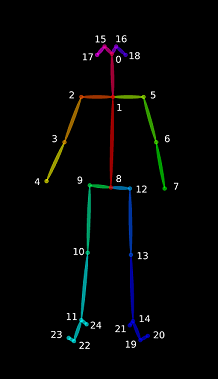

Here you can see the output order of the skeleton, which might be relevant to consider in case certain joints need to be 
excluded.

### Generating Motion-Images

The central task of this project is to visualize the motion of the skeleton as an image to use as an Input for the CNN.
Sedmidubsky et al. (2018). creates Images based on normalised 3D-Transformations (positions, orientations) to use as an Input
for a CNN. The normalization is based on a reference joint in the hierarchy, which is then used to transform the other 
joints into a local space. This assumes that we always have the data available for the whole skeleton, which is reasonable
when working with MoCap-Data as an Input.

#### Normalisation of motion data

In this project two different methods were implemented to normalize the raw data from OpenPose. 
The first approach was to calculate the center of the bounding box of the skeleton and 
use that to put the joints into a local space.
The second approach was to use a reference point in this case the nose to put the other joints
into a local space. The problem here is, that it is possible for the nose to not be recognized
in some cases.
Since the second approach showed some better results initially the images provided are normalized
based on the nose.

#### Encoding of 2D-Skeleton into RGB

For a 2D-Skeleton it is necessary to consider what data is relevant to encode into the motion images.
Aubry et al. compare the use of the mean value of the 2D coordinates against the confidence value provided by OpenPose
to use as the third value. They come to the conclusion that the confidence value is more relevant to use.
Since that is the case for this project each joint was encoded into RGB as (normalized_X, normalized_Y, confidence) and all joints
represented one row. Each row then represented a frame. The sampling size of the frames was put at 60.

|Video Daten                          |RGB Image                            | Frames | Joints |
|-------------------------------------|:-----------------------------------:|:------:|:------:|
|    |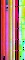|  60    |   25   |

## Comparison of HMDB51 and custom dataset

|Custom Data                          |HMDB51 Data                                 |
|-------------------------------------|:------------------------------------------:|
||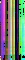   |

I just want to make a note of the difference between the custom data I generated and the data taken from HMDB51.
The motion images are extracted using the same method. The data I generated will have the whole skeleton captured
for the most part with a relatively high confidence value.

# Models

In this project we want to use several models to evaluate if the generated Motion Images contain recognizable
patterns for a CNN to sort them into the given classes. For that I have selected some of the standard image classification
models, referencing Aubrey et al. on the relevant networks to test.

## AlexNet

The AlexNet was supposed to be a baseline for the project. 

Layer (type)                |Output Shape             |Param #   |
|---------------------------|:-----------------------:|:--------:|
conv2d_1 (Conv2D)           |(None, 62, 62, 96)       |34944     |
max_pooling2d_1 (MaxPooling2|(None, 31, 31, 96)       |0         |
conv2d_2 (Conv2D)           |(None, 21, 21, 256)      |2973952   |
max_pooling2d_2 (MaxPooling2|(None, 10, 10, 256)      |0         |
conv2d_3 (Conv2D)           |(None, 8, 8, 384)        |885120    |
conv2d_4 (Conv2D)           |(None, 6, 6, 384)        |1327488   |
conv2d_5 (Conv2D)           |(None, 4, 4, 256)        |884992    |
max_pooling2d_3 (MaxPooling2|(None, 2, 2, 256)        |0         |
flatten_1 (Flatten)         |(None, 1024)             |0         |
dense_1 (Dense)             |(None, 4096)             |4198400   |
dropout_1 (Dropout)         |(None, 4096)             |0         |
dense_2 (Dense)             |(None, 4096)             |16781312  |
dropout_2 (Dropout)         |(None, 4096)             |0         |
dense_3 (Dense)             |(None, 1000)             |4097000   |
dropout_3 (Dropout)         |(None, 1000)             |0         |
dense_4 (Dense)             |(None, 5)                |5005      |

Total params: 31,188,213
Trainable params: 31,188,213
Non-trainable params: 0
_________________________________________________________________

|                                                                                |                                                                            | 
|--------------------------------------------------------------------------------|:---------------------------------------------------------------------------|
| 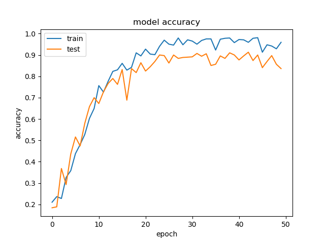 | 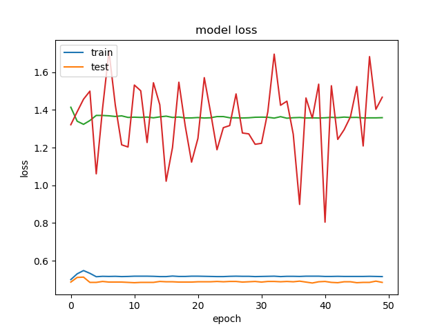 |

## DenseNet

Layer (type)                |Output Shape             |Param #   |
|---------------------------|:-----------------------:|:--------:|
conv2d_1 (Conv2D)           |(None, 62, 62, 96)       |34944     |
max_pooling2d_1 (MaxPooling2|(None, 31, 31, 96)       |0         |
conv2d_2 (Conv2D)           |(None, 21, 21, 256)      |2973952   |
max_pooling2d_2 (MaxPooling2|(None, 10, 10, 256)      |0         |
conv2d_3 (Conv2D)           |(None, 8, 8, 384)        |885120    |
conv2d_4 (Conv2D)           |(None, 6, 6, 384)        |1327488   |
conv2d_5 (Conv2D)           |(None, 4, 4, 256)        |884992    |
max_pooling2d_3 (MaxPooling2|(None, 2, 2, 256)        |0         |
flatten_1 (Flatten)         |(None, 1024)             |0         |
dense_1 (Dense)             |(None, 4096)             |4198400   |
dropout_1 (Dropout)         |(None, 4096)             |0         |
dense_2 (Dense)             |(None, 4096)             |16781312  |
dropout_2 (Dropout)         |(None, 4096)             |0         |
dense_3 (Dense)             |(None, 1000)             |4097000   |
dropout_3 (Dropout)         |(None, 1000)             |0         |
dense_4 (Dense)             |(None, 5)                |5005      |

Total params: 31,188,213
Trainable params: 31,188,213
Non-trainable params: 0
_________________________________________________________________
|                                                                                 |                                                                            |
|---------------------------------------------------------------------------------|----------------------------------------------------------------------------|
| 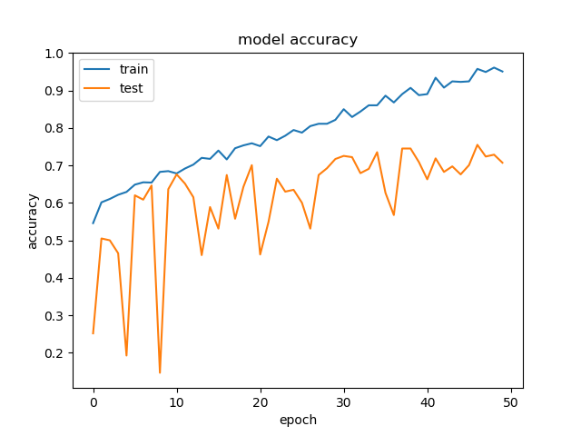 | 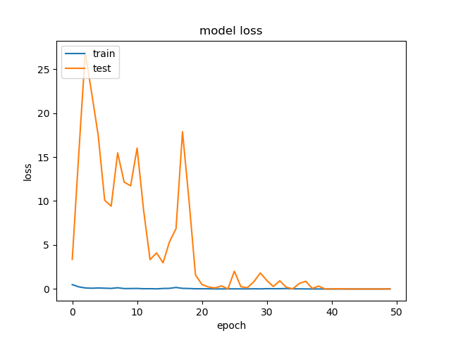|


## Simple Convolutional Network

This is just supposed to be a reference network to put the results into perspective.

|Layer (type)                |Output Shape             |Param #   |
|----------------------------|:-----------------------:|:--------:|
|conv2d_1 (Conv2D)           |(None, 58, 23, 64)       |1792      |
|conv2d_2 (Conv2D)           |(None, 56, 21, 64)       |36928     |
|flatten_1 (Flatten)         |(None, 75264)            |0         |
|dense_1 (Dense)             |(None, 64)               |4816960   |
|dense_2 (Dense)             |(None, 64)               |4160      |
|dense_3 (Dense)             |(None, 5)                |325       |
Total params: 4,860,165
Trainable params: 4,860,165
Non-trainable params: 0
_________________________________________________________________

|                                                                                   |                                                                              |                                     
|-----------------------------------------------------------------------------------|:-----------------------------------------------------------------------------|
|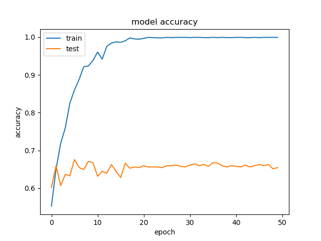 |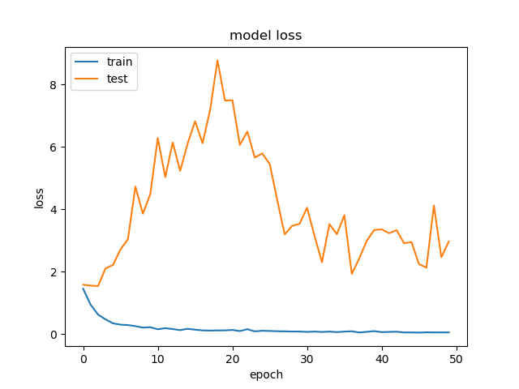|

## NeuralNet

A simple Neural Net to put the CNN approach into perspective.

|Layer (type)        |        Output Shape       |      Param #   |
|--------------------|:-------------------------:|:--------------:|
|dense_1 (Dense)     |        (None, 128)        |      576128    |
|dense_2 (Dense)     |        (None, 64)         |      8256      |
|dense_3 (Dense)     |        (None, 64)         |      4160      |
|dense_4 (Dense)     |        (None, 5)          |      325       |

Total params: 588,869
Trainable params: 588,869
Non-trainable params: 0
_________________________________________________________________
|                                                                                 |                                                                              | 
|---------------------------------------------------------------------------------|:----------------------------------------------------------------------------:| 
|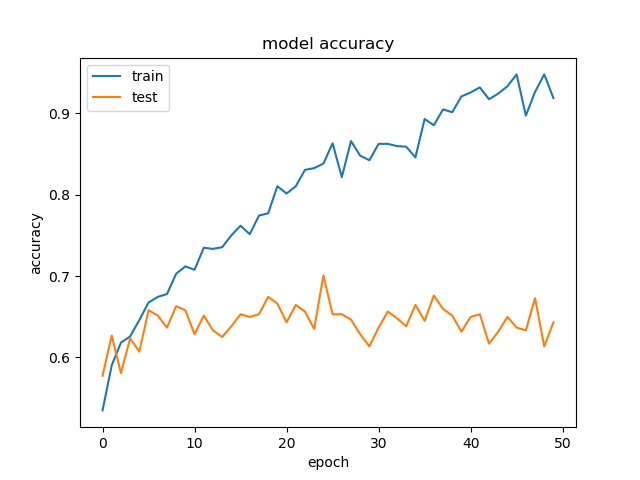 | 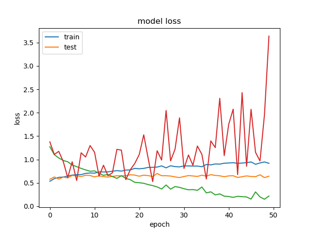 |


## TwoStream CNN

Li et al. (2019) suggest using a two stream framework to introduce the frame by frame skeleton data with the
frame to frame difference. This should add relevant features for the network to work with and make the classification
more reliable.

[Two Stream Architecture](doc/images/Li_TwoStream.PNG)

The first input here would be the motion image. The second Input is the differences between the joint positions between
the current frame and the previous frame.

|Layer (type)                    |Output Shape         Param #    |Connected to                     |
|--------------------------------|:------------------------------:|:-------------------------------:|
|joints (InputLayer)             |(None, 60, 25, 3)    0          |                                 |
|joints_diff (InputLayer)        |(None, 60, 25, 3)    0          |                                 |
|conv2d_1 (Conv2D)               |(None, 60, 25, 32)   128        |joints[0][0]                     |
|conv2d_4 (Conv2D)               |(None, 60, 25, 32)   128        |joints_diff[0][0]                |
|batch_normalization_1 (BatchNor |(None, 60, 25, 32)   128        |conv2d_1[0][0]                   |
|batch_normalization_4 (BatchNor |(None, 60, 25, 32)   128        |conv2d_4[0][0]                   |
|leaky_re_lu_1 (LeakyReLU)       |(None, 60, 25, 32)   0          |batch_normalization_1[0][0]      |
|leaky_re_lu_4 (LeakyReLU)       |(None, 60, 25, 32)   0          |batch_normalization_4[0][0]      |
|conv2d_2 (Conv2D)               |(None, 60, 25, 16)   1552       |leaky_re_lu_1[0][0]              |
|conv2d_5 (Conv2D)               |(None, 60, 25, 16)   1552       |leaky_re_lu_4[0][0]              |
|batch_normalization_2 (BatchNor |(None, 60, 25, 16)   64         |conv2d_2[0][0]                   |
|batch_normalization_5 (BatchNor |(None, 60, 25, 16)   64         |conv2d_5[0][0]                   |
|leaky_re_lu_2 (LeakyReLU)       |(None, 60, 25, 16)   0          |batch_normalization_2[0][0]      |
|leaky_re_lu_5 (LeakyReLU)       |(None, 60, 25, 16)   0          |batch_normalization_5[0][0]      |
|permute_1 (Permute)             |(None, 60, 16, 25)   0          |leaky_re_lu_2[0][0]              |
|permute_2 (Permute)             |(None, 60, 16, 25)   0          |leaky_re_lu_5[0][0]              |
|conv2d_3 (Conv2D)               |(None, 60, 16, 16)   3616       |permute_1[0][0]                  |
|conv2d_6 (Conv2D)               |(None, 60, 16, 16)   3616       |permute_2[0][0]                  |
|batch_normalization_3 (BatchNor |(None, 60, 16, 16)   64         |conv2d_3[0][0]                   |
|batch_normalization_6 (BatchNor |(None, 60, 16, 16)   64         |conv2d_6[0][0]                   |
|leaky_re_lu_3 (LeakyReLU)       |(None, 60, 16, 16)   0          |batch_normalization_3[0][0]      |
|leaky_re_lu_6 (LeakyReLU)       |(None, 60, 16, 16)   0          |batch_normalization_6[0][0]      |
|concatenate_1 (Concatenate)     |(None, 60, 16, 32)   0          |leaky_re_lu_3[0][0]              |
|                                |                                |leaky_re_lu_6[0][0]              |
|conv2d_7 (Conv2D)               |(None, 60, 16, 32)   1056       |concatenate_1[0][0]              |
|batch_normalization_7 (BatchNor |(None, 60, 16, 32)   128        |conv2d_7[0][0]                   |
|leaky_re_lu_7 (LeakyReLU)       |(None, 60, 16, 32)   0          |batch_normalization_7[0][0]      |
|max_pooling2d_1 (MaxPooling2D)  |(None, 30, 8, 32)    0          |leaky_re_lu_7[0][0]              |
|dropout_1 (Dropout)             |(None, 30, 8, 32)    0          |max_pooling2d_1[0][0]            |
|conv2d_8 (Conv2D)               |(None, 30, 8, 64)    2112       |dropout_1[0][0]                  |
|batch_normalization_8 (BatchNor |(None, 30, 8, 64)    256        |conv2d_8[0][0]                   |
|leaky_re_lu_8 (LeakyReLU)       |(None, 30, 8, 64)    0          |batch_normalization_8[0][0]      |
|max_pooling2d_2 (MaxPooling2D)  |(None, 15, 4, 64)    0          |leaky_re_lu_8[0][0]              |
|dropout_2 (Dropout)             |(None, 15, 4, 64)    0          |max_pooling2d_2[0][0]            |
|flatten_1 (Flatten)             |(None, 3840)         0          |dropout_2[0][0]                  |
|dense_1 (Dense)                 |(None, 64)           245824     |flatten_1[0][0]                  |
|dense_2 (Dense)                 |(None, 5)            325        |dense_1[0][0]                    |
Total params: 260,805
Trainable params: 260,357
Non-trainable params: 448
__________________________________________________________________________________________________
|    classes                |                                                                             |                                      | 
|---------------------------|:----------------------------------------------------------------------------|--------------------------------------|
| stand/walk/sit/punch/wave |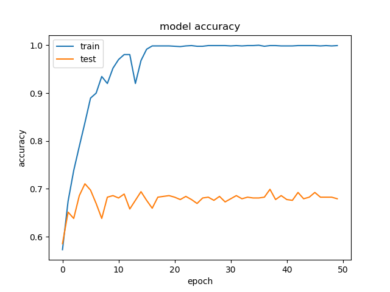    | 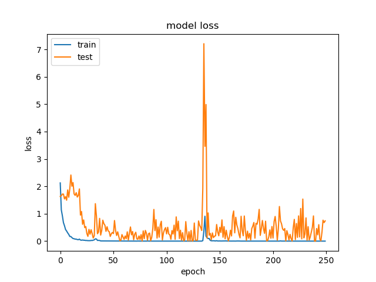|
| stand/walk/sit            |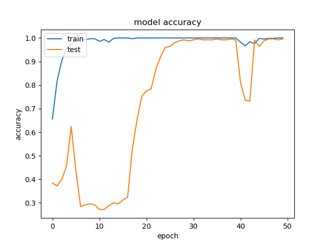| |

# Results from Training the Network

| Model         | Accuracy(in %)    | Test Score |
|---------------|:-----------------:|------------|  
| AlexNet       | 82.10             |  0.37      |
| DenseNet      | 98.94             |  0.01371   |
| SimpleCNNet   | 67.92             |  3.2001    |   
| TwoStreamNet  | 97.23             |  0.2324    |
| NNet          | 97.17             |  0.1165    |

When comparing the data to other research projects, the accuracy of the network seems very high. The reason for this is clearly
that the dataset used here does not contain variance. If we input another video into this that does not match the parameters
of the Input data than the accuracy would decrease. We can assume that this network does not generalize data well.

For this project it would be ideal to follow up with using another dataset to verify the motion images 

# Discussion 
## Data

### Dataset

As already mentioned the given database might not be ideal for the project
and there are better alternatives. The HMDB51 that was initially used here, was not able
to provide the data needed for the final goal of the project. The quality was either 
not acceptable for OpenPose to recognize skeletons reliably or did not contain enough
data once the videos were filtered by quality.

The dataset I created was only used to verify that motion images can be used to classify
motions. If this dataset was to be used for anything other than this specific case,
there would need to be more variance in the data. Also train, validation and test data would need to be clearly defined
as to not have an overlap, which was the case here. This caused some fake success in the test scores which
caused problems in the long run.

Jun et al. (2019) introduce [NTU-RGB+D](http://rose1.ntu.edu.sg/Datasets/actionRecognition.asp) as a large
RGB+D dataset of 114.480 video samples with variant camera settings. This would be the database to use
to get good reliable data with enough variants.

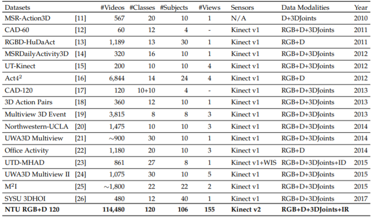

#### Test Data
When generating the custom data the separation of train, validation and test cases has not been considered enough.
For future reference a clear distinction should be made.

### Extraction of seperate parameters from the data

The TwoStream Network was an interesting approach to consider for this problem.
In this project the second input is just (f - (f-1)), where f is the a row in the image
representing a frame and (f-1) is the previous previous frame.
This should represent the change over time. Other parameters to consider would be angles between joints,
which need to be calculated based on three points for each limb.

# Conclusion
This project can be used to extract motion images from a given dataset based on the implemented normalization and quickly 
run the included models over the data. It is possible to generate a video with labeled frames based on those models.

This project cannot validate the produced motion images as a good input format for Convolutional Neural Networks.
The collected data merely shows that a convolutional neura network can be overfitted to the given set of images.


#References:
##Paper

- **[Cao, 2019]** [OpenPose: Realtime Multi-Person 2D Pose Estimation using Part Affinity Fields](https://arxiv.org/pdf/1812.08008.pdf)
- **[Sedmidubsky, 2018]** [Effective and efficient similarity searching in motion capture data](https://link.springer.com/article/10.1007/s11042-017-4859-7)
- **[Aubrey, 2018]** [Action recognition based on 2D skeletons extracted from RGB videos](https://pdfs.semanticscholar.org/dc55/a0bd15f2852f4025541b709ad0f0e21a8720.pdf)
- **[Jun, 2019]** [A Large-Scale Benchmark for 3D Human Activity Understanding](https://arxiv.org/pdf/1905.04757.pdf)
- **[Li, 2019]** [Co-occurrence Feature Learning from Skeleton Data for Action Recognition and Detection with Hierarchical Aggregation](https://arxiv.org/pdf/1804.06055.pdf)

## Github Links

**[OpenPose]**(https://github.com/CMU-Perceptual-Computing-Lab/openpose)
**[Reference to find resources]**(https://github.com/cagbal/Skeleton-Based-Action-Recognition-Papers-and-Notes)
**[Two Stream architecture reference]**(https://github.com/fandulu/Keras-for-Co-occurrence-Feature-Learning-from-Skeleton-Data-for-Action-Recognition)

# Using this project

The three main functionalities of this project are:
- transform video data to motion images
- train one of the prepared models on the data
- use a video and let a model classify the frames

Generate a dataset based on a root directory containing a folder for each class. 

```bash
python create_data.py --root_path ./data/source --output_path ./data/trainCustom --video_format avi
```
|Params         |Description                                                                  |
|---------------|:-------------------------------------------------------------------------------:|
|root_path      |Path to the root of the data set. We assume that the data is sorted into classes.|
|output_path    |Path to the output directory                                                     |
|video_formats  |Formats to look for in the dataset. Split by  (avi|mp4)                          |                                                       |                    
|sample_size    |Number of frames for one motion image                                            |
|joint_number   |Number of joints to expect                                                       |
|steps          |Param to overlap data to augment. By default it should match sample_size         |

Train the model based on the given image data.

```bash
python train.py --train_images ./data/train --model AlexNet --epochs 50 --batch_size 32 --useAllJoints 1 --dataset all
```
|Params           |Description                                                                    |
|-----------------|:-----------------------------------------------------------------------------:|
|train_images     |Path to training image.                                                        |
|model            |Specify model to train with (AlexNet|DenseNet|TwoStreamNet|SimpleCNNet|NNet)   |
|epochs           |Number of epochs to run (default 50)                                           |                    
|batch_size       |Batch size (default 16)                                                        |
|useAllJoints     |Joint number to use (True=25, False=14) (default 1)                            |
|dataset',        |Dataset to use (hmdb51|custom|all)')                                           |


Use the given model to run on a video.

```bash
python run.py --train_images ./data/train --model AlexNet --epochs 50 --batch_size 32 --useAllJoints 1 --dataset all
```
|Params         |Description                                                                  |
|---------------|:---------------------------------------------------------------------------:|
|model_path     |Path to the model.                                                           |
|weight_path    |Path to the weights                                                          |
|video_path     |Path to the video.                                                           |                    
|model_type     |Name of the trained model. AlexNet|DenseNet|TwoStreamNet|SimpleCNNet|NNet    |
|output_path    |Path to write output video to.                                               |


