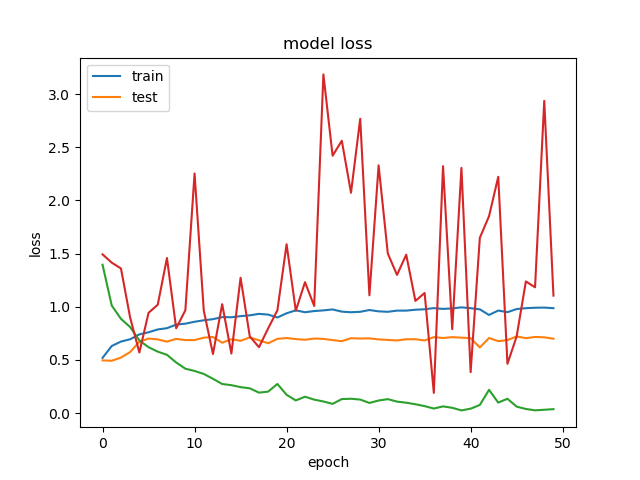

# Problembeschreibung

Zunächst hatte ich eine Projektidee zur Erzeugung von 3D Daten basierend auf dem OpenPose Skelett.
Dies konnte ich wegen der Komplexität der Problemstellung vor allem in Hinsicht auf die zu verwendende Architektur
und mangelnder Zeit nicht in der Umsetzung verfolgen.

Ziel dieses Projektes ist es mit OpenPose als Grundlage zur Erkennung
von 2D-Skeletten Bewegungen zu Klassifizieren. Das Netzwerk soll in der Lage
sein basierend auf dem Output Skelett von OpenPose 5 verschiedene
Bewegungsklassen zu unterscheiden. Die Daten zum Trainieren sollen dabei selbst erstellt und vorverarbeitet
werden.

# Umsetzung

## Daten

### Round 1
Im Rahmen der ersten Projektidee, habe ich zunächst angefangen Motion-Capture-Daten zu sammeln und auf einen Avatar anzuwenden.
Hiermit wollte ich die zu erzeugenden 3D-Daten bekommen. Die MoCap-Daten sollten dann auf dem Avatar von einer Kamera-Perspektive gerendert
werden um die Bilddaten zu Erzeugen. Um den Input für das Netzwerk zu erhalten, werden diese Bilddaten durch OpenPose weiterverarbeitet
um letzendlich eine 2D-Position pro Joint pro Frame zu erhalten. Hier lag der Schwerpunkt auf der Erstellung der 3D-Output Daten.

### Round 2

Nachdem festgestellt wurde, dass das Projekt zu komplex für den Zeitrahmen ist, war ich nicht auf die 3D-Daten angewiesen und brauchte
eine Datenbank zur Klassifizierung. Ich habe zunächst die [HMDB51](https://serre-lab.clps.brown.edu/resource/hmdb-a-large-human-motion-database/#dataset)
gefunden.

Die daten sind hier in Klassen unterteilt und im AVI format gespeichert. D.H. pro Bewegungs-Klasse gibt es einen Ordner mit allen dazugehörigen Clips welche zwischen 1 und 5 Sekunden lang sind.
Des Weitern kann man anhand der Label MetaDaten ablesen.

|PROPERTY                               |LABELS (ABBREVIATION)                                      |
|---------------------------------------|:---------------------------------------------------------:|              
|visible body parts                     |	head(h), upper body(u), full body (f), lower body(l)    |
|_______________________________________|___________________________________________________________|
|camera motion                          |	motion (cm), static (nm)                                |
|_______________________________________|___________________________________________________________|
|camera viewpoint                       |	Front (fr), back (ba), left(le), right(ri)              |
|_______________________________________|___________________________________________________________|
|number of people involved in the action|	Single (np1), two (np2), three (np3)                    |
|_______________________________________|___________________________________________________________|
|video quality                          |	good (goo), medium (med), ok (bad)                      |
|_______________________________________|___________________________________________________________|

In diesem Projekt sollten nur Daten verwendet, in der eine einzige Person vorkommt.
Damit sollte sich die Suche beschränken auf (u/f/l)_(cm/nm)_(fr/ba/le/ri)_(np1)_(goo/med/bad).


## Vorverarbeitung der Daten

### OpenPose
Zur Vorverarbeitung der Daten wurde [OpenPose](https://github.com/CMU-Perceptual-Computing-Lab/openpose) verwendet.
OpenPose erzeugt je nach verwendetem Model (BODY25) ein 2D-Skelett von maximal 25 Joints mit jeweils X und Z Koordinaten basierend auf dem Inputframe.(s. Abbildung 1)


### Bewegung zu RGB

Für ein Convolutional Neural Network müssen die Bewegungsdaten von dem gegebenen Skelett visualisiert werden.
Nach Sedmidubsky et al können 3D-Bewegungsdaten nach Normalisierung der Joint Positionen und Orientierungen in ein RGB-Bild
übertragen werden. In dem genannten Projekt beruhen die Normalisierungen jedoch auf einem konstanten Skelett. 
D.h. alle Joints haben zu jedem Frame Daten. In diesem Projekt kann man nicht davon ausgehen, dass immer das gesamte Skelett erfasst wird. D.h. wir werden nicht in der Lage sein alle
Joints in einen Raum zu transformieren (z.B. Hip).
Eine Normalisierung des Skeletts soll anhand der BoundingBox für jedes Frame umgesetzt werden. Dabei errechnen wir anhand der vorhandenen
Positionen die Maximal- und Minimalwerte und nehmen dann das Zenter als Referenzpunkt
Eine weitere Frage bleibt was man in für den Blauwert verwendet um die Daten zu verschlüsseln.Aubry et al vergleichen die Verwendung des Mean von der X und Y Koordinate sowie die Verwendung des Confidence-Wertes von OpenPose.
Das Ergebniss zeigte, dass der Confidence-Wert ein vergleichsweise mehr Relevanz zur Klassifizierung der Bewegung hat. 


# Model

Das AlexNet-Model gilt als eines der Standard Netzwerke zur Bildklassifizierung und soll anhand der
im Rahmen des Projektes erstellten Daten getestet werden um vergleichbare Ergebnisse zu bekommen.

## AlexNet

Layer (type)                |Output Shape             |Param #   |
|---------------------------|:-----------------------:|:--------:|
conv2d_1 (Conv2D)           |(None, 62, 62, 96)       |34944     |
max_pooling2d_1 (MaxPooling2|(None, 31, 31, 96)       |0         |
conv2d_2 (Conv2D)           |(None, 21, 21, 256)      |2973952   |
max_pooling2d_2 (MaxPooling2|(None, 10, 10, 256)      |0         |
conv2d_3 (Conv2D)           |(None, 8, 8, 384)        |885120    |
conv2d_4 (Conv2D)           |(None, 6, 6, 384)        |1327488   |
conv2d_5 (Conv2D)           |(None, 4, 4, 256)        |884992    |
max_pooling2d_3 (MaxPooling2|(None, 2, 2, 256)        |0         |
flatten_1 (Flatten)         |(None, 1024)             |0         |
dense_1 (Dense)             |(None, 4096)             |4198400   |
dropout_1 (Dropout)         |(None, 4096)             |0         |
dense_2 (Dense)             |(None, 4096)             |16781312  |
dropout_2 (Dropout)         |(None, 4096)             |0         |
dense_3 (Dense)             |(None, 1000)             |4097000   |
dropout_3 (Dropout)         |(None, 1000)             |0         |
dense_4 (Dense)             |(None, 5)                |5005      |

Total params: 31,188,213
Trainable params: 31,188,213
Non-trainable params: 0
_________________________________________________________________


## DenseNet

Layer (type)                |Output Shape             |Param #   |
|---------------------------|:-----------------------:|:--------:|
conv2d_1 (Conv2D)           |(None, 62, 62, 96)       |34944     |
max_pooling2d_1 (MaxPooling2|(None, 31, 31, 96)       |0         |
conv2d_2 (Conv2D)           |(None, 21, 21, 256)      |2973952   |
max_pooling2d_2 (MaxPooling2|(None, 10, 10, 256)      |0         |
conv2d_3 (Conv2D)           |(None, 8, 8, 384)        |885120    |
conv2d_4 (Conv2D)           |(None, 6, 6, 384)        |1327488   |
conv2d_5 (Conv2D)           |(None, 4, 4, 256)        |884992    |
max_pooling2d_3 (MaxPooling2|(None, 2, 2, 256)        |0         |
flatten_1 (Flatten)         |(None, 1024)             |0         |
dense_1 (Dense)             |(None, 4096)             |4198400   |
dropout_1 (Dropout)         |(None, 4096)             |0         |
dense_2 (Dense)             |(None, 4096)             |16781312  |
dropout_2 (Dropout)         |(None, 4096)             |0         |
dense_3 (Dense)             |(None, 1000)             |4097000   |
dropout_3 (Dropout)         |(None, 1000)             |0         |
dense_4 (Dense)             |(None, 5)                |5005      |

Total params: 31,188,213
Trainable params: 31,188,213
Non-trainable params: 0
_________________________________________________________________


## Simple Convolutional Network

|Layer (type)                |Output Shape             |Param #   |
|----------------------------|:-----------------------:|:--------:|
|conv2d_1 (Conv2D)           |(None, 58, 23, 64)       |1792      |
|conv2d_2 (Conv2D)           |(None, 56, 21, 64)       |36928     |
|flatten_1 (Flatten)         |(None, 75264)            |0         |
|dense_1 (Dense)             |(None, 64)               |4816960   |
|dense_2 (Dense)             |(None, 64)               |4160      |
|dense_3 (Dense)             |(None, 5)                |325       |
Total params: 4,860,165
Trainable params: 4,860,165
Non-trainable params: 0
_________________________________________________________________


## TwoStreamCNNetwork

|Layer (type)                    |Output Shape         Param #    |Connected to                     |
|--------------------------------|:------------------------------:|:-------------------------------:|
|joints (InputLayer)             |(None, 60, 25, 3)    0          |                                 |
|joints_diff (InputLayer)        |(None, 60, 25, 3)    0          |                                 |
|conv2d_1 (Conv2D)               |(None, 60, 25, 32)   128        |joints[0][0]                     |
|conv2d_4 (Conv2D)               |(None, 60, 25, 32)   128        |joints_diff[0][0]                |
|batch_normalization_1 (BatchNor |(None, 60, 25, 32)   128        |conv2d_1[0][0]                   |
|batch_normalization_4 (BatchNor |(None, 60, 25, 32)   128        |conv2d_4[0][0]                   |
|leaky_re_lu_1 (LeakyReLU)       |(None, 60, 25, 32)   0          |batch_normalization_1[0][0]      |
|leaky_re_lu_4 (LeakyReLU)       |(None, 60, 25, 32)   0          |batch_normalization_4[0][0]      |
|conv2d_2 (Conv2D)               |(None, 60, 25, 16)   1552       |leaky_re_lu_1[0][0]              |
|conv2d_5 (Conv2D)               |(None, 60, 25, 16)   1552       |leaky_re_lu_4[0][0]              |
|batch_normalization_2 (BatchNor |(None, 60, 25, 16)   64         |conv2d_2[0][0]                   |
|batch_normalization_5 (BatchNor |(None, 60, 25, 16)   64         |conv2d_5[0][0]                   |
|leaky_re_lu_2 (LeakyReLU)       |(None, 60, 25, 16)   0          |batch_normalization_2[0][0]      |
|leaky_re_lu_5 (LeakyReLU)       |(None, 60, 25, 16)   0          |batch_normalization_5[0][0]      |
|permute_1 (Permute)             |(None, 60, 16, 25)   0          |leaky_re_lu_2[0][0]              |
|permute_2 (Permute)             |(None, 60, 16, 25)   0          |leaky_re_lu_5[0][0]              |
|conv2d_3 (Conv2D)               |(None, 60, 16, 16)   3616       |permute_1[0][0]                  |
|conv2d_6 (Conv2D)               |(None, 60, 16, 16)   3616       |permute_2[0][0]                  |
|batch_normalization_3 (BatchNor |(None, 60, 16, 16)   64         |conv2d_3[0][0]                   |
|batch_normalization_6 (BatchNor |(None, 60, 16, 16)   64         |conv2d_6[0][0]                   |
|leaky_re_lu_3 (LeakyReLU)       |(None, 60, 16, 16)   0          |batch_normalization_3[0][0]      |
|leaky_re_lu_6 (LeakyReLU)       |(None, 60, 16, 16)   0          |batch_normalization_6[0][0]      |
|concatenate_1 (Concatenate)     |(None, 60, 16, 32)   0          |leaky_re_lu_3[0][0]              |
|                                |                                |leaky_re_lu_6[0][0]              |
|conv2d_7 (Conv2D)               |(None, 60, 16, 32)   1056       |concatenate_1[0][0]              |
|batch_normalization_7 (BatchNor |(None, 60, 16, 32)   128        |conv2d_7[0][0]                   |
|leaky_re_lu_7 (LeakyReLU)       |(None, 60, 16, 32)   0          |batch_normalization_7[0][0]      |
|max_pooling2d_1 (MaxPooling2D)  |(None, 30, 8, 32)    0          |leaky_re_lu_7[0][0]              |
|dropout_1 (Dropout)             |(None, 30, 8, 32)    0          |max_pooling2d_1[0][0]            |
|conv2d_8 (Conv2D)               |(None, 30, 8, 64)    2112       |dropout_1[0][0]                  |
|batch_normalization_8 (BatchNor |(None, 30, 8, 64)    256        |conv2d_8[0][0]                   |
|leaky_re_lu_8 (LeakyReLU)       |(None, 30, 8, 64)    0          |batch_normalization_8[0][0]      |
|max_pooling2d_2 (MaxPooling2D)  |(None, 15, 4, 64)    0          |leaky_re_lu_8[0][0]              |
|dropout_2 (Dropout)             |(None, 15, 4, 64)    0          |max_pooling2d_2[0][0]            |
|flatten_1 (Flatten)             |(None, 3840)         0          |dropout_2[0][0]                  |
|dense_1 (Dense)                 |(None, 64)           245824     |flatten_1[0][0]                  |
|dense_2 (Dense)                 |(None, 5)            325        |dense_1[0][0]                    |
Total params: 260,805
Trainable params: 260,357
Non-trainable params: 448
__________________________________________________________________________________________________




## NeuralNet

Ein einfaches neurales Netywerk bei dem die Image Daten als einfaches Array übergeben werden.


|Layer (type)        |        Output Shape       |      Param #   |
|--------------------|:-------------------------:|:--------------:|
|dense_1 (Dense)     |        (None, 128)        |      576128    |
|dense_2 (Dense)     |        (None, 64)         |      8256      |
|dense_3 (Dense)     |        (None, 64)         |      4160      |
|dense_4 (Dense)     |        (None, 5)          |      325       |

Total params: 588,869
Trainable params: 588,869
Non-trainable params: 0
_________________________________________________________________


#Nutzung des Projektes

Trainiere das Model anhand der gegebenen Bilddaten mit (60, 25, 3) als Shape.

```bash
python train.py --train_images ./data/train --model AlexNet --epochs 50 --batch_size 32 --useAllJoints 1 --dataset all
```
|Params           |Description                                                                    |
|-----------------|:-----------------------------------------------------------------------------:|
|train_images     |Path to training image.                                                        |
|model            |Specify model to train with (AlexNet|DenseNet|TwoStreamNet|SimpleCNNet|NNet)   |
|epochs           |Number of epochs to run (default 50)                                           |                    
|batch_size       |Batch size (default 16)                                                        |
|useAllJoints     |Joint number to use (True=25, False=14) (default 1)                            |
|dataset',        |Dataset to use (hmdb51|custom|all)')                                           |


Nutze das gegebene bekannte Model um dieses auf einem Video laufen zu lassen.

```bash
python run.py --train_images ./data/train --model AlexNet --epochs 50 --batch_size 32 --useAllJoints 1 --dataset all
```
|Params         |Description                                                                  |
|---------------|:---------------------------------------------------------------------------:|
|model_path     |Path to the model.                                                           |
|weight_path    |Path to the weights                                                          |
|video_path     |Path to the video.                                                           |                    
|model_type     |Name of the trained model. AlexNet|DenseNet|TwoStreamNet|SimpleCNNet|NNet    |
|output_path    |Path to write output video to.                                               |
